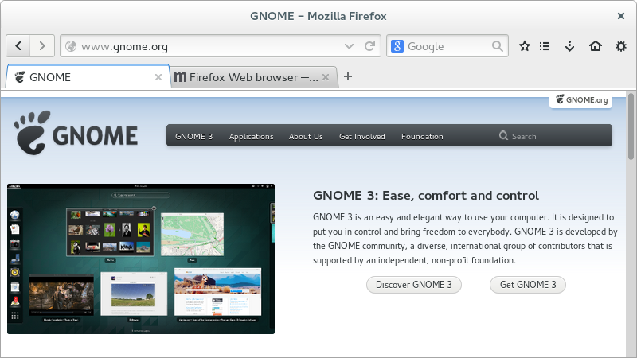

# GNOME theme for Firefox

The latest stable version is always available from [Mozilla's Add-ons](https://addons.mozilla.org/firefox/addon/adwaita/).

Bleeding-edge releases are usually made avilable on [Launchpad](https://launchpad.net/gnome-integration/firefox-gnome/firefox-gnome-releases) and early-access builds are also on [our GitHub releases page](https://github.com/gnome-integration-team/firefox-gnome/releases).

List of current issues is available at our [bug tracker](https://github.com/gnome-integration-team/firefox-gnome/issues).

Help & feedback are both appreciated! ;-)

## How to build

You can use __make-xpi.py__ script to build xpi and clean temporary files:

```Bash
$ ./make-xpi.py [TARGET]
$ python3 make-xpi.py [TARGET]
```

Available targets: _all_, _theme_, _extension_ and _clean_. Default is _all_.

For more details please check [this page](https://github.com/seleznev/firefox-complete-theme-build-system#firefox-complete-theme-build-system).

## Screenshots

Default:



With some tweaks, made available by [GNOME Theme Tweak](https://addons.mozilla.org/firefox/addon/gnome-theme-tweak/), Firefox can even look close to native on GNOME 3.12+:


